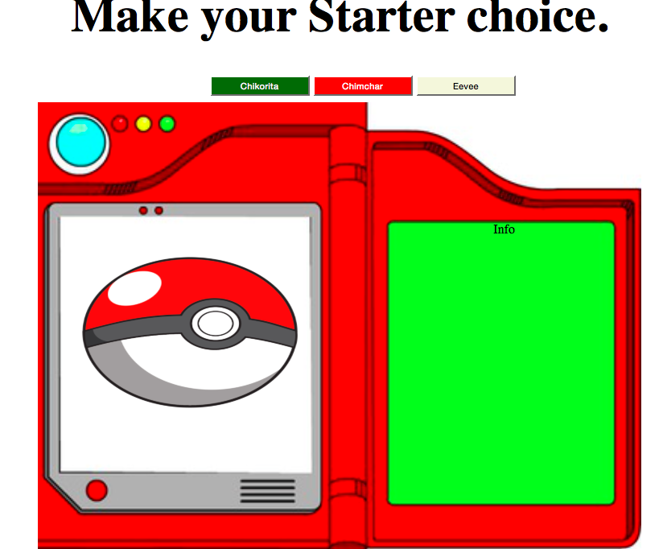

# Pokeapi1
Gotta catch em all!!! But first you need a starter pokemon. Here the User can make that choice.

## How It's Made:

**Tech used:** HTML, CSS, JavaScript, APIs

I made a Pokedex that a User can click on grass, fire, or normal starter pokemon. From there they will see their starter pokemon and the basics of that pokemon.

## Lessons Learned:

Built an API for the first time and it was fun(*insert anononym). I made it as clean and make sure it all fit into the pokedex and show each information and pokemon on seperate pages to be redirected to.
